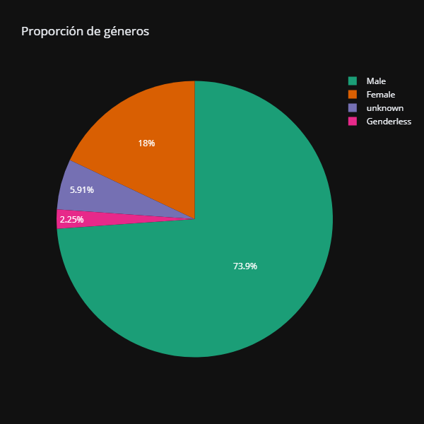
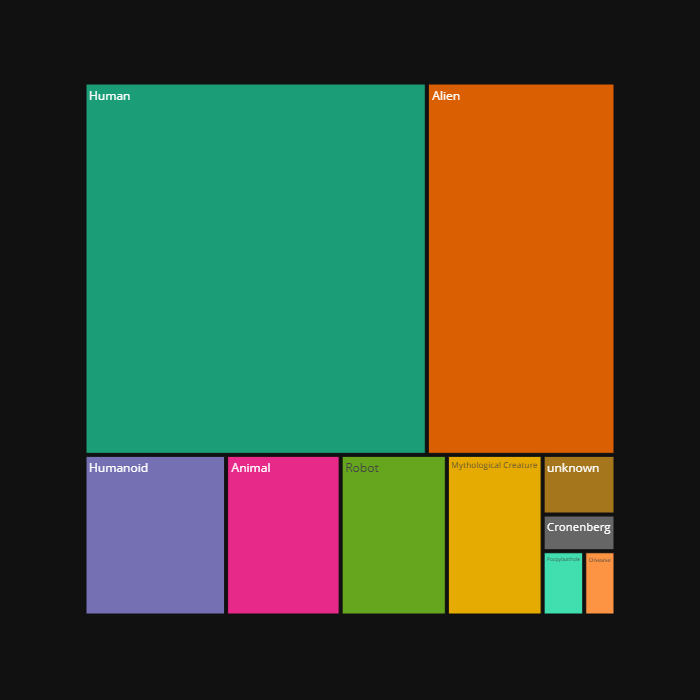

# Rick&Morty Data Analysis - Obtención de datos a través de una API

## 📄 Descripción del Proyecto

Este proyecto realiza adquisición de datos a través de una API (Rick and Morty). Los datos se obtienen a través de una función con una consulta 'requests' integrada. Tras ello, se procesan y analizan los datos enfocándose en la proporción de géneros y el tamaño de las especies. Finalmente se visualizan los resultados para proporcionar una visión clara y comprensible del universo de Rick and Morty.

## 📚 Contenido del Proyecto

- Datos utilizados.
- Visualizaciones.
- Conclusiones.
- Instalación y uso.
- Contacto.

## 📊 Datos Utilizados

Los datos fueron obtenidos de la [API de Rick and Morty](https://rickandmortyapi.com/). El conjunto de datos incluye información sobre los personajes, sus géneros, episodios, especies y otras características relevantes.  

## 📈 Visualizaciones

### Proporción de Géneros

### Tamaño de las Especies

Las visualizaciones muestran la distribución de géneros entre los personajes y la variedad de tamaños de las especies presentes en el universo de Rick and Morty.

## 📌 Conclusiones

- **Diversidad de Géneros**: la proporción de géneros entre los personajes de Rick y Morty revela una tendencia hacia el género 'Male', el cual es un 73,9% del total.
- **Variedad de Especies**: el análisis del tamaño de las especies destaca la riqueza y variedad biológica en el universo de Rick y Morty, teniendo 2 especies predominantes: 'Human' y 'Alien'.

## 🚀 Instalación

Para ejecutar este proyecto localmente, sigue estos pasos:

1. Clona el repositorio en tu terminal utilizando el código:
git clone https://github.com/martahinojosa1/API_Rick-and-Morty.git

2. Navega al directorio del proyecto:
cd rick-and-morty-data-analysis

3. Crea y activa un entorno virtual (opcional pero recomendado):
virtualenv venv
source venv/bin/activate      # En Windows usa venv\Scripts\activate

4. Instala las dependencias:
pip install -r requirements.txt

## 📧 Contacto

- Nombre: Marta Hinojosa
- Email: martahinojosa.001@gmail.com
- LinkedIn: https://www.linkedin.com/in/marta-hinojosa-jimenez/

 
